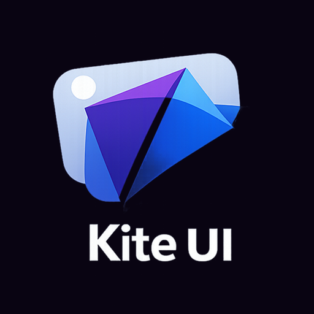

# Kite 🪁

<p align="center">
  
</p>

**Kite** is a developer-friendly Flutter devpack with a modern design system, reusable UI components, responsive primitives, extensions, and application foundations.

```dart
import 'package:kite/kite_ui.dart';
```

Kite is intentionally close to Flutter. Components are ordinary widgets, themes are ordinary `ThemeData`, and generated application code remains yours.

## What the package exports

- `KiteApp` for Navigator and Router 2.0 applications.
- Design primitives: `KiteTheme`, `KiteColors`, `KiteTypography`, `Dimensions`, and `Shapes`.
- Responsive primitives: `ResponsiveKite`, `KiteResponsive`, `KitePage`, `KiteGrid`, `KiteSplit`, `KiteSplitLayout`, and `KiteResponsiveLayout`.
- 30+ reusable UI components covering inputs, actions, navigation, feedback, overlays, and content.
- Flutter-focused extensions for `BuildContext`, widgets, strings, collections, dates, colors, durations, numbers, URIs, maps, text styles, and controllers.

## Install

```yaml
# pubspec.yaml
dependencies:
  kite: ^1.0.1
```

```dart
import 'package:kite/kite_ui.dart';
```

## Minimal application

```dart
void main() {
  runApp(
    KiteApp(
      title: 'My App',
      theme: KiteTheme.use(
        color: AppColors.lightColors,
        brightness: Brightness.light,
      ),
      darkTheme: KiteTheme.use(
        color: AppColors.darkColors,
        brightness: Brightness.dark,
      ),
      home: const HomePage(),
    ),
  );
}
```

!!! note
    The source package currently exports its public Flutter API from `package:kite/kite_ui.dart`. The `lib/kite.dart` file is not the public barrel and contains no package API.
